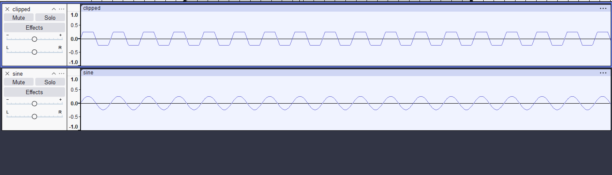
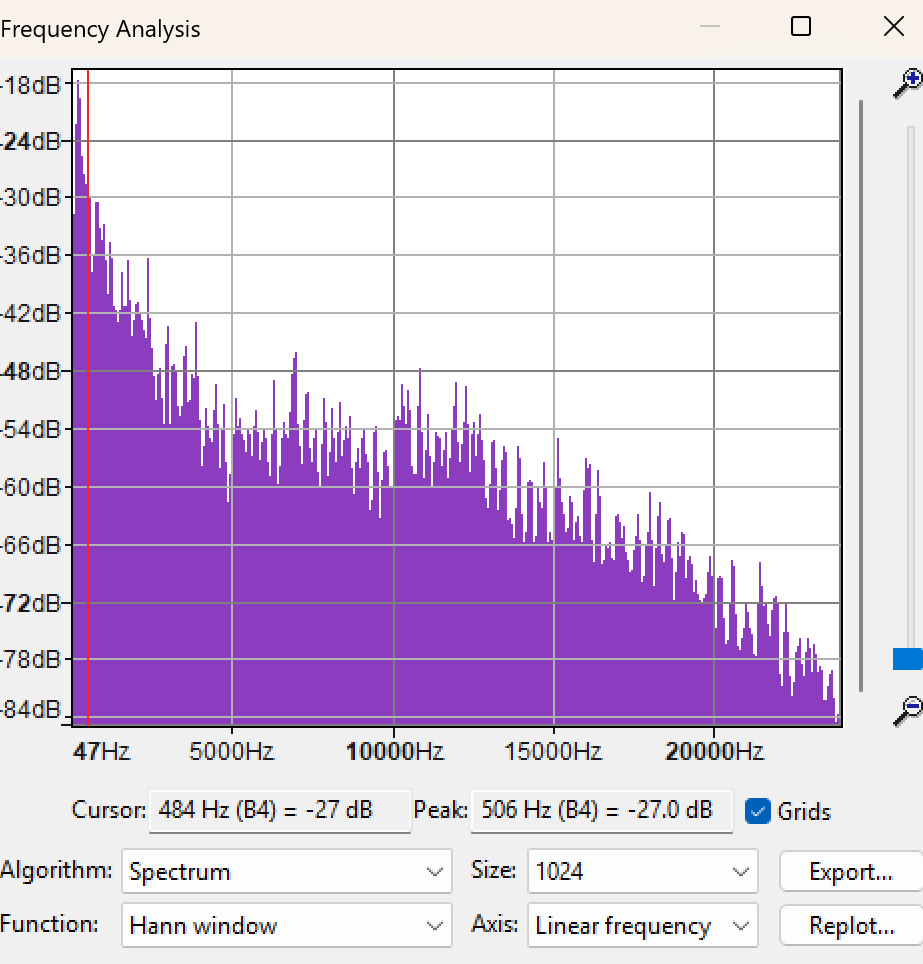
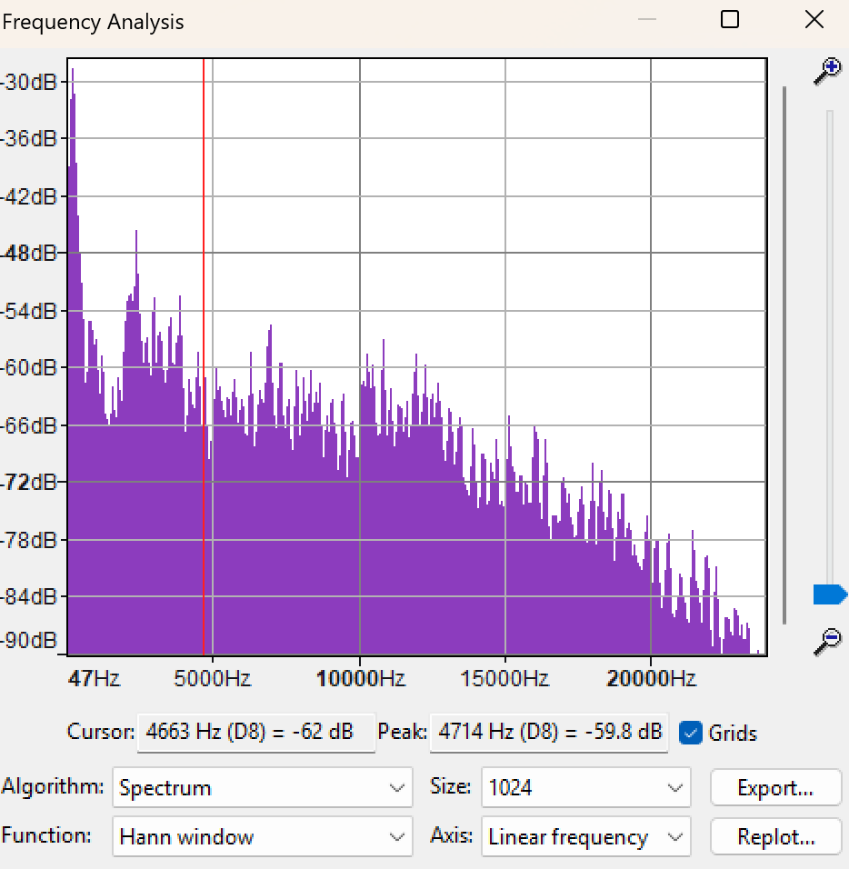

# 10-01-2024
## Establishing a format
Today I was hoping to spend my time getting the repo up and ideally figuring out a format I can repeat for my engineering journal. A cursory google search did not pull up any templates sadly so I decided on this, a date in H1, a entry title in H2 and a line break at the end of the entry.
```
# Date
## Title
text
---
```

--- 

# 10-08-2024
## Assignment 1
Worked on assignment 1 today. My major sticking points were
- numpy wanting to set the dtype as float32, needed to use `.astype`
- Code snippet from scipy had some things I couldn't understand why they were there. mostly this in the sin function
`2. * np.pi *`
Update 10/15/2024: It turns out you need those contstants since sin is related to pi 

That said everything looks good in audacity. I'm not sure what a 440hz wave should sound like


---
--- 

# 10-15-2024
## DFT, FT, Intro
Just did my intro and watched the first two fourier transform videos today, I think I will play with some code on thursday and finish up the videos.
here is the text of my intro(not sure if it is needed)
```
Hi everyone, I'm max. I'm an undergraduate student hopefully graduating in the spring. I have no experience with playing music but do enjoy listening to it at least so maybe that will be helpful lol. I am mostly taking this class because I watched a youtube video about the tools the aphex twin guy used and thought it seemed cool
```
---
--- 

# 10-17-2024
## DFT, FT
Finished watching all the videos , 
wrote a [jupyter notebook](code/messing_with_notes.ipynb) trying to generate all notes per octave starting from a base `fs`  I think I want to play with the FIR filter too if I have time. Also interested in making the different notes sound smoother from one to the other. 
Added some code in the messing with notes to sort of let me use the top of my keyboard to play notes. I need to figure out how to make it play while the key is being held down but it is fun for now

---
--- 

# 10-29-2024
## Starting work on the tone control project
Started work today on the tone control project but ran into problems with the FFT element of it. Spent some time playing with it but think I will need to do more research into scipy.fft to figure out where I am going wrong

---
--- 

# 10-31-2024
## Continuing work on the tone control project ( thinking about term project )
Today I got my fft mostly working, still want to add a sine for some other sort of windowing function to it but thats okay, also got my filters set up so feeling pretty good. Need to spend some time doing research on the filters so I know what I'm doing since right now I am going off a [blog post](https://swharden.com/blog/2020-09-23-signal-filtering-in-python/) and I think it is too abstract.
Got the power ratios down too so now I just need to scale and recombine to output. 

I think for my term project I am interested in building some sort of vocoder or something similar. Not sure what yet but that seems the most interesting to me.

---

--- 

# 11-1&2-2024
## Continuing work on the tone control project 

Using the repo [tone.py](https://github.com/pdx-cs-sound/tone-control/blob/main/tone.py) I am getting closer. I have my filter working using the state and it sounds good. Now trying to figure out scaling. Hard to tell if I am doing it right or not...
Goal is to use fft at each window I am filtering and take values, find min, find x to make all other values,equal to min
use that as volume scale each filtered window

---
--- 

# 11-5-2024
## Continuing work on the tone control project 

tried switching average for mean to get rid of nan
As it turns out I had an error in my code where I was storing array indices instead of actual frequencies


Pre

Post


It looks like he have more work to do.. I am assuming we want the new one to look like a wall? or at least similar. I can see I am bring the low down alright... Besides the extreme low. But the extreme high might need to be turned up? Or it is possible there are no freqs at that so even my attempts at scaling aren't helping

---
--- 

# 11-17-2024
## Messing with rhosy code and trying to get minilouge esque display to work
playing around a lot with matplotlib in trying to get a display of the wave to the synth is generating to show ala korg minilouge. I love the screen on the minilouge. 

Trials:
using anim function. 
needs to call flush which causes latency. either the input loop needs changing or need to find a better way to do this. 

Think I am leaning towards blitting. Ideally would like an object you can add to your soundevice.output and then display the sound as it is coming.

Seems like threading will be the main problem here. 


---
--- 

# 11-19-2024
## Completely refactored 

Took out all the code from rhosy and dragged it into classes, the classes are lame but now I can start playing with wave generators more.

using a lot of FP here, so taking the 3 base waves I got from misy.py (link) and applying other function to combine/reduce or trying at chords.

right now I am using the ratios described [here](https://music.stackexchange.com/questions/88572/how-are-chord-ratios-developed-exactly) which are 1.000000000 : 1.25992105 : 1.498307077. so I take the function and return a function that takes the same arguments but sums them by this ratio


---

---

# 11-26-2024
## Start work on popgen
Today I just added an envelope. Doing this was pretty easy since the np linspace class makes it easy to generate a smooth ramp up and down and then you can just multiply the corresponding values by that.

What I actually did was make a np array that is [ 0...1,1,1,1...1, 0.99...0 ] and the same length as our sample array

---

---

# 11-26-2024
## Adding Generators 

Now I had to add generators, I reused the same generators from my synth since I already knew these worked. Since I wanted these to be interchangable, I had to a function param to my `make_note` function.

Doing this also allowed me to add a noise generator to fufill the background noise requirement.

I simply  created a generator that made random noises over the sample t
this allowed me to re use the same code for making the notes but just passing in this function

---

---

# 11-26-2024
## Playing with note length, etc.

This is where my lack of formal music knowledge made it hard to know if what I was doing made sense or not. I needed each note in the melody to sum to the length of the bass chord. This meant I had to divide by the number of notes I wanted to play in the melody. But this also forced each note into being equal length which I knew I would have to change later. 


---

---

# 12-3-2024
## Adding Command line args

Note: each notes can be broken down into fractional notes so we can represent [1,2,1,1]

I first added a method to parse a list of arguments, so I could change the deault chord loop.

Next I added a weird list that is not super human readable or good but represents the number of times it a note should be played in the melody and what insturment it should use.
Note since every note is still allocated a single beat, the length of each note is `beatlength/number_of_times`. 

---

---

# 12-3-2024
## Re structuring my synth again...
around this time I restructured my synth since I wanted to add the ability to play samples to it. 
This worked fairly well but had some (a lot ) of issues. The biggest problem with the sample was reseting the location when a key was let up

Also we had to switch to a memozation approach since otherwise it was too slow. which caused a ton of problems since I then had to reset notes

---

---

# 12-3-2024
## Finally working on my term project
I wanted to for my project make a cool sample machine, midi thing that played .mid files could do looping etc. 


This was going well until I realized there was no easy way to view the midi files I was generating in my editor of choice (VSCode).

I initially set out to just quickly make a vscode extension to be able to preview them as text (I had never written a vscode extension, but how hard could it be)

I initally tried out just using the webview demo and changing it showing the midi as text (which worked okay). But this had to be instantiated with a command to pop up a new window which was clunky

So then I settled in to a custom editor, which I initially tried using a text editor, but you can only use actual text files within a text editor which is problematic since .mid files arent text but rather binaries.

So I finally settled on the `customDocument` editor which allowed me the flexibility I needed to show the midi. After about 10 hours of work I compilied my extension and installed and thought I would be good to continue on my term project... 

I realized that this wasn't enough so I went back to it, since I wanted a way to hear my midi files in the document. 

I finally found this awesome library https://github.com/surikov/webaudiofont which had support for playing midi files with a variety of insturements and was pretty sweet. 

I pretty much just crammed in the provided example for playing midi files https://surikov.github.io/webaudiofont/examples/midiplayer.html and then also pass out the json, but by then I felt like this was cool enough to be my individual project and I could sort of abandon my old idea (not because it wasnt working...). 

Here is the url for viewing it. [https://github.com/mackenzie-norman/editor_example/](https://github.com/mackenzie-norman/editor_example/)

I think it came out pretty neat and I got to learn about VSCode extensions.